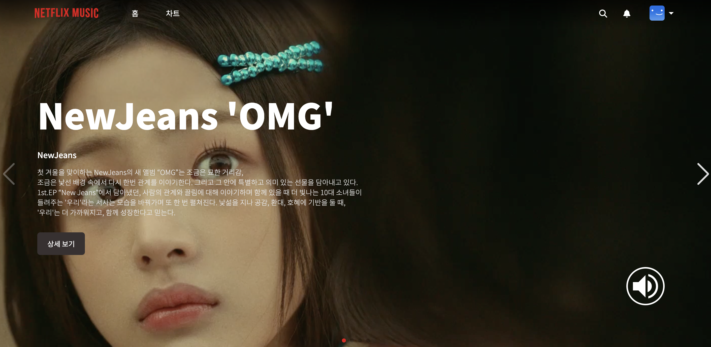
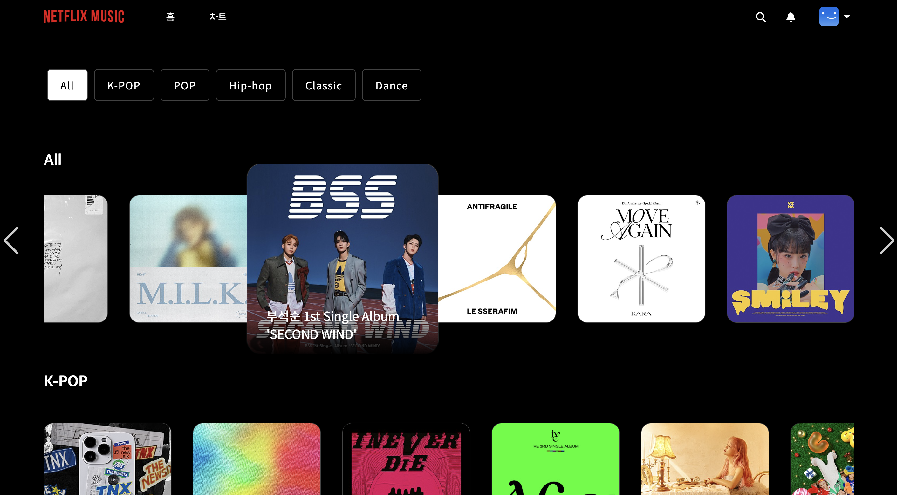
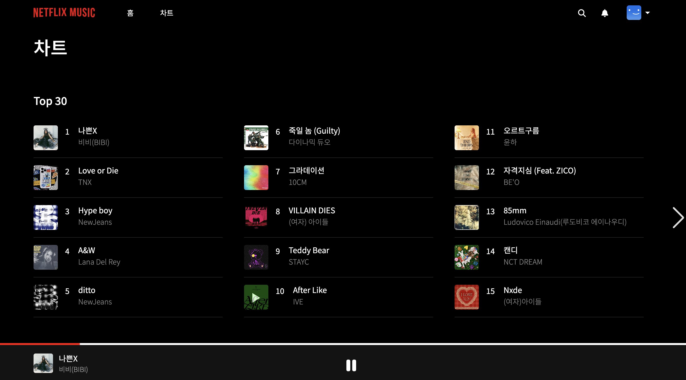

# Netflix-Music

<div align="center">
  
</div>

## 팀원 소개

|                                      김은정                                      |                                     박성재                                      |                                      최두루                                      |                                      최지영                                      |
| :------------------------------------------------------------------------------: | :-----------------------------------------------------------------------------: | :------------------------------------------------------------------------------: | :------------------------------------------------------------------------------: |
|  |  |  |  |
|                       [@0uizi0](https://github.com/0uizi0)                       |                [@qkrtjdwo5662](https://github.com/qkrtjdwo5662)                 |                    [@Drew-Choi](https://github.com/Drew-Choi)                    |                     [@totoback](https://github.com/totoback)                     |

## 프로젝트 소개

넷플릭스 레이아웃 형태에서 착안한 넷플릭스 뮤직 웹 서비스입니다.

## 시작 가이드

### Requirements

For building and running the application you need:

### Installation

```bash
$ git clone https://github.com/0uizi0/netflix-music.git
$ cd netflix-music
```

---

## Stacks 🐈

### Environment


### Development


### Communication


---

## 화면 구성 📺

|                             메인 배너                             |                            장르별 앨범                             |
| :---------------------------------------------------------------: | :----------------------------------------------------------------: |
|  |  |
|                             음악 차트                             |

| 
